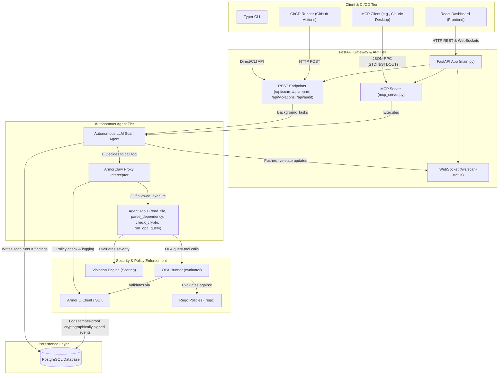
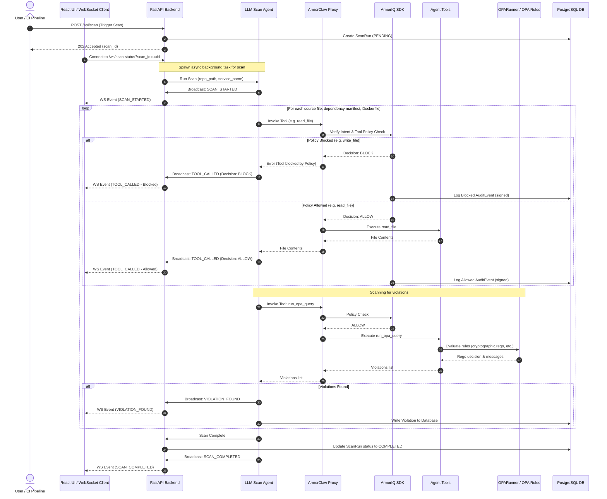

# ComplianceGuard AI

> **Autonomous AI agent for continuous security and compliance monitoring.**
> Powered by LLM reasoning, Open Policy Agent (OPA), and ArmorIQ policy enforcement.

---

## 📖 Overview

**ComplianceGuard AI** is a state-of-the-art security compliance platform. It runs a continuous `scan ➔ enforce ➔ report` loop orchestrated by an autonomous AI agent, leveraging Open Policy Agent (OPA) for structured checks, and the ArmorIQ SDK to intercept and validate all agent actions. Every scan, violation, and agent decision is cryptographically audited and visualized in real-time.

```
                  ┌──────────────────────────────┐
                  │      ComplianceGuard AI      │
                  │   scan ➔ enforce ➔ report    │
                  └──────────────┬───────────────┘
                                 ▼
                     Autonomous LLM Scanning
                                 ▼
                 ArmorIQ SDK Intercept & Enforce
                                 ▼
                    Structured PDF/JSON Reports
```

---

## ✨ Features

- **Autonomous LLM Scanning**: Scans repository contents (source files, Dockerfiles, and dependencies) using custom tool-calling agents.
- **ArmorIQ Interception & Policy Gate**: Intercepts every tool call, verifies agent intent, logs tamper-proof cryptographic metadata, and enforces strict boundary policies.
- **Open Policy Agent (OPA)**: Runs lightning-fast compliance evaluations using Rego policy files (covering container security, cryptographic strength, dependencies, access control, etc.).
- **Real-Time WebSocket Updates**: Broadcasts progress, tools called, decisions, and discovered violations directly to the React dashboard.
- **CI/CD Integration**: Automates compliance checks as pull request gates to fail builds when `HIGH` severity violations are detected.
- **Model Context Protocol (MCP)**: Integrates seamlessly as an MCP server, sharing tools with external AI clients (like Claude Desktop).

---

## 🏗️ System Architecture

ComplianceGuard AI follows a modular architecture that separates client layers, orchestration gateways, autonomous agent runtimes, policy engines, and audit logs.

### Component Architecture

The following diagram illustrates how the frontend components, API endpoints, agent loop, OPA engine, and database communicate with each other and the ArmorIQ SDK.



### Scan Flow & Interception Lifecycle

Every scan runs asynchronously, utilizing a secure interception pattern to prevent unapproved agent tool executions. Here is the step-by-step lifecyle of a compliance scan:



---

## 🛠️ Tech Stack

### Backend
- **Core Framework**: FastAPI, Pydantic v2, Pydantic Settings
- **ORM & DB**: SQLAlchemy 2.0 (Asyncio), Alembic, PostgreSQL (`asyncpg`)
- **Security & Policies**: ArmorIQ SDK & ArmorClaw, Open Policy Agent (Rego rules)
- **Agent Orchestration**: MCP Python SDK, Typer (CLI)

### Frontend
- **Framework**: React 18, TypeScript, Vite
- **Styling**: Tailwind CSS
- **Icons & Visualization**: Lucide React, Recharts

### Infrastructure
- **Containerization**: Docker, Docker Compose

---

## 📁 Repository Structure

```
compliance-ai/
├── README.md                           # Main Documentation
├── docker-compose.yml                  # Local development compose setup
├── .env.example                        # Environment variables template
├── backend/                            # Python FastAPI Backend
│   ├── main.py                         # Application Entrypoint
│   ├── settings.py                     # App Config & Environment loader
│   ├── armoriq_client.py               # ArmorIQ Initialization Client
│   ├── armoriq_shims.py                # Interception wrappers for agent tools
│   ├── cli.py                          # Typer command-line tool
│   ├── mcp_server.py                   # Model Context Protocol server
│   ├── api/                            # API routes (REST and WebSockets)
│   │   ├── scan.py                     # Scan run triggers and polling
│   │   ├── report.py                   # Report generators (PDF/JSON)
│   │   ├── violations.py               # Violations retrieval
│   │   ├── audit.py                    # Cryptographic audit log retrieval
│   │   └── ws.py                       # WebSocket broadcaster
│   ├── agent/                          # Autonomous Scan Agent
│   │   ├── scan_agent.py               # ArmorClaw agent definition
│   │   ├── tools/                      # Scan agent tools
│   │   └── prompts/                    # Agent System & Scan Prompts
│   ├── engine/                         # Evaluation & Scoring
│   │   ├── violation_engine.py         # Severity classifier
│   │   ├── report_generator.py         # Compliance Report generation
│   │   └── audit_logger.py             # ArmorIQ Event persistence
│   ├── db/                             # Database Models and Session
│   └── policies/                       # OPA Rego Policies & Runner
│       ├── opa_runner.py               # OPA execution layer
│       └── *.rego                      # Rego files (crypto, container, etc.)
├── frontend/                           # React + Vite Frontend
│   ├── src/
│   │   ├── App.tsx                     # Main dashboard page
│   │   ├── components/                 # UI components (graphs, tables)
│   │   ├── hooks/                      # Custom React hooks (WS, Fetch)
│   │   └── api/                        # HTTP client
└── ci/                                 # CI/CD pipelines
    ├── github-action.yml               # GitHub Actions workflow definition
    └── scan_trigger.sh                 # Trigger automation script
```

---

## 🚀 Getting Started

### Prerequisites
- [Docker](https://www.docker.com/) & Docker Compose
- ArmorIQ API Key
- Python 3.12+ (if running CLI / MCP server locally)

### Quick Start (Docker)

1. Clone the repository.
2. Copy `.env.example` to `.env` and fill in your `ARMORIQ_API_KEY`:
   ```bash
   cp .env.example .env
   ```
3. Start the entire system:
   ```bash
   docker-compose up --build
   ```
4. Access the web dashboard at `http://localhost:5173` and backend API documentation at `http://localhost:8000/docs`.

### Local Setup (Development)

#### Backend Setup
```bash
cd backend
python -m venv venv
source venv/bin/activate
pip install -r requirements.txt
uvicorn main:app --host 0.0.0.0 --port 8000 --reload
```

#### Frontend Setup
```bash
cd frontend
npm install
npm run dev
```

---

## 💡 Usage

### 1. Web Dashboard
Open `http://localhost:5173` to interact with the visual dashboard. Trigger scans by providing a directory path, watch the real-time progress bar, view detailed violations grouped by severity, and inspect tamper-proof audit trails.

### 2. Typer CLI
You can execute compliance scans directly from your terminal:
```bash
# Activate backend virtual environment first
python -m backend.cli scan "MyService" "/path/to/repo"

# List previous scan results
python -m backend.cli list-scans
```

### 3. Model Context Protocol (MCP) Server
Integrate compliance tools with LLMs (e.g. Claude Desktop):
```bash
python -m backend.mcp_server
```

#### Configure Claude Desktop
Add this to your `claude_desktop_config.json`:
```json
{
  "mcpServers": {
    "compliance-guard": {
      "command": "python",
      "args": ["-m", "backend.mcp_server"],
      "env": {
        "ARMORIQ_API_KEY": "your_armoriq_api_key_here"
      }
    }
  }
}
```

### 4. API Documentation

| Method | Endpoint | Description |
| :--- | :--- | :--- |
| `POST` | `/api/scan` | Trigger a new compliance scan asynchronously |
| `GET` | `/api/scan/{scan_id}` | Retrieve scan progress and overall metadata |
| `GET` | `/api/violations` | Retrieve list of violations (filter by scan, severity) |
| `GET` | `/api/report/{scan_id}` | Retrieve structured JSON compliance report |
| `GET` | `/api/audit/{scan_id}` | Retrieve cryptographic audit logs from ArmorIQ |
| `WS` | `/ws/scan-status` | Subscribe to WebSocket event logs |
